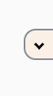

### Userscript to get the viewed full image on Instagram
Click the button to the right side of the screen or `d` keyboard shortcut.

[On Greasy Fork](https://greasyfork.org/en/scripts/377853-instagram-image-viewer).

You need to be in the page of the image and not on that fancy foreground image display. eg. right click open in new tab instead of left clicking an image on a profile.
